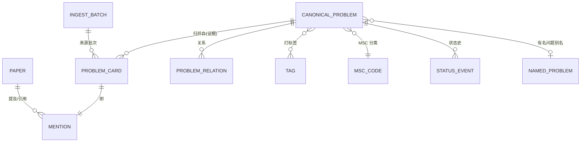

# 数学开放问题库 · 数据库设计 v1（讨论稿）

> 2026-09-23 · 基于安安 10 条需求答复整理
> 状态：讨论稿——导师/专业老师审阅前不改管线代码

---

## 一、需求决议（2026-09-23 用户拍板）

| # | 问题 | 决议 |
|---|---|---|
| 1 | 读者 | **开源发布给全球数学社区** |
| 2 | 用途 | **讨论平台**：已解决的上来分享解释；未解决的讨论思路、征解 |
| 3 | 同一问题多卡 | **归并为一个条目**（canonical entity） |
| 4 | 问题间关系 | **要建**（特例/推广/等价/蕴含…） |
| 5 | 收录粒度与档案 | **要建问题档案**：提出处、被引网络、方向分支、数学性质；分类贴标签是核心需求（类比 B 站标签体系） |
| 6 | 人工审核 | 暂缓，流程清晰后请专业老师负责 |
| 8 | 多数据集注入 | **必须支持**（arXiv 之外还有别的数据源要进） |
| 9 | 版权 | 先建后补合法性（风险自担，见 §7） |
| 10 | 发布形态 | 先规整存储，发布渠道后定 |
| 11 | 项目定位（2026-09-29 拍板） | **AI 是工具，解释权归研究者**：AI 负责抽取、归并建议、检索、甚至证明尝试；但问题的解释、状态的裁定、讨论的主导权属于全球研究者。工程上对外部平台能抄则抄、去粗取精 |

---

## 二、路线图：两阶段，数据核心先行

```
阶段 A（现在 → 数据成型）          阶段 B（数据成熟后）
┌─────────────────────┐          ┌──────────────────────┐
│  数据核心 Data Core  │   UID    │  社区讨论平台          │
│  · canonical schema │  ──不变→  │  · 讨论/征解/解法分享   │
│  · SQLite + git 导出 │          │  · 用户系统/通知        │
│  · 多源注入管线      │          │  · 现成框架，不自研论坛  │
└─────────────────────┘          └──────────────────────┘
```

**核心原则：数据与讨论彻底分离。** 每个规范问题有全局唯一 UID，将来讨论层（不管用什么框架）只引用 UID 挂接。数据核心做得干净，平台可以随时换、随时重搭，讨论记录不丢。

阶段 B 强烈建议不自研论坛——用 Discourse（自托管）或 GitHub Discussions 起步，数学社区对这两种形态接受度高。

---

## 三、Schema v1



### 表设计要点

**canonical_problem**（社区真正的"一个条目"）
- `uid`：全局唯一、永不变（如 `op-2026-000001`），平台/导出/引用全靠它
- `statement_en` / `statement_zh`：规范化陈述（LLM 改写 + 人工复核后定稿）
- `status`：open / solved / partially_solved / controversial
- `origin_paper_doi`、`origin_year`：首次提出处（档案核心字段）
- `msc_primary`、`msc_secondary`：MSC 2020 二级码
- `review_state`：machine_extracted / human_verified / published（审核态，暂不启用但字段先留）

**problem_card**（我们现在 377+ 张卡的原样，一张不丢）
- 就是现有六分类卡：verbatim_quote、label、confidence、paper、锚点
- 挂到 canonical_problem 下作为**证据**——归并决策可追溯、可撤销

**problem_relation**
- `kind`：specializes / generalizes / equivalent_to / implies / motivated_by / appears_in
- `evidence_card_id`：每条关系也要有证据（哪篇论文说的）

**tag 体系（两层，见 §4）**

**status_event**：问题状态变化的事件链（何年、谁、依据哪篇论文判定 solved）

**ingest_batch / source_dataset**：多数据集注入的溯源——每张卡记录"来自哪个批次哪个数据源"，将来注入 OEIS、PolymathWiki、named problems 数据集时不需要改 schema

### 归并（第 3 条决议）的落地方式

不做"物理合并"，做**证据型归并**：多张卡指向同一 canonical_problem，判据（DOI+标题相似度/有名问题别名/LLM 判断）存在 relation 上。判错了可以拆——归并永远是可逆的编辑操作，不是删除。

---

## 四、分类标签体系（用户标记的核心需求）

数学家的归类习惯 ≈ **一个 MSC 骨架 + 多个正交维度 + 自由标签**，三层：

| 层 | 内容 | 例子 | 来源 |
|---|---|---|---|
| 1. 受控骨架 | MSC 2020 二级码 | 11R75、14J60、37K20 | 全球标准，必须用 |
| 2. 正交维度标签 | 分支 / 问题类型 / 数学结构 / 已知条件 | 「存在性」「有限性」「与 RH 等价」「需要 ZFC+大基数」 | 自建受控词表（先 50-100 个起步） |
| 3. 自由标签 | 社区习惯叫法 | Berry conjecture、KPZ 固定点 | 开放打，配别名表 |

**有名问题单独建档**：数学界有大量 "Berry 猜想" 式命名问题，建 `named_problem` 别名字典（英文名/中文名/缩写 → uid），检索和归一都靠它。这部分有现成开源数据（Wikipedia 名单、PolymathWiki）可注入——正好满足第 8 条。

**"被哪些文章引用"的档案**：输入 DOI 调 OpenCitations / Semantic Scholar API 可全自动抓取引用网络——档案愿景里自动化程度最高的一块，管线加个脚本就行。

---

## 五、技术栈（按"学生可维护"选型）

| 层 | 阶段 A（现在） | 阶段 B（平台） |
|---|---|---|
| 存储 | SQLite（单文件、零运维、十万条内无压力） | PostgreSQL（迁移路径平滑） |
| 版本化 | git 仓库存 JSONL 导出（每次跑批一个 commit，可回溯可 diff） | 同左 |
| 全文检索 | SQLite FTS5（够用） | Meilisearch / pg_trgm |
| 语义检索 | 后续加 embedding 列（"找相似问题"是数学家的刚需） | 同左 |
| 讨论层 | 无 | Discourse 自托管 / GitHub Discussions，UID 挂接 |

---

## 六、处理管线（2026-09-23 12:05 用户批准全部 4 项推荐）

1. **归并策略：宁缺勿滥**——判不准就独立建条目，社区发现重复再合并（配合并工具）；阈值设置偏保守
2. **双版本陈述**：库内同时存 `verbatim_quote`（证据）+ `statement_rewritten`（发布版，AI 改写待复核）——新增改写阶段，每 canonical 条目一次 LLM 调用
3. **语言**：条目陈述英文为主，MSC 标签双语，界面中文层后置
4. **uncertain 卡**：照常入库，挂 `review_state=draft`，不进公开检索，等人工复核，不删
5. **已抽取数据的补抽清单**（对已抽出的卡发小请求，全文缓存都在，无需重跑）：
   - A. 问题命名（文中有无名字/怎么称呼）→ 别名字典种子
   - B. 关系提及（特例/推广/等价/蕴含哪些已知问题）→ problem_relation 素材
   - C. 陈述上下文窗口（quote 前后原文，纯本地切窗口，不耗 API）
6. **引用档案**：OpenCitations/S2 API 独立脚本（输入 DOI 出引用网络），与抽取解耦

## 七、风险记录（如实）

- 版权"先斩后奏"：逐字引用论文陈述公开发布，多数出版社默认不允许。缓解：发布版用规范化改写陈述 + 原文留在引用（短引文属合理使用范畴），等导师把关
- 归并质量：同名不同题、同题异名是重灾区，NAMED_PROBLEM 字典 + 人工抽检是底线

## 八、下一步（待批准）

1. 本文档给导师/专业老师过目 → 定稿
2. 定稿后：SQLite DDL 落地 + 现有 573 张卡导入 canonical 结构（可逆、不破坏现有 pilot 数据）
3. OpenCitations 引用档案脚本（输入 DOI 出引用网络）
4. 正交维度词表初稿（50 个起步）

---

## 九、阶段 B 先例调研：前人做过的"开放问题社区"（2026-09-29 补充）

> 结论先行：**"围绕开放数学问题建讨论社区"这件事有 20+ 年前人史，2025-2026 因 AI 破题潮正在扎堆重做；但"全域研究级问题档案 + 结构化状态史 + 文献溯源 + 讨论"四位一体的形态尚无人做成。** 我们的差异化空间真实存在。

### 三代先例

| 代际 | 代表 | 形态 | 现状与教训 |
|---|---|---|---|
| 一代（2001-2009，静态名单） | **TOPP**（Open Problems Project，计算几何，2001） | 每题永久编号可引用，GitHub PR 更新状态 | 78 题，已停收新题；证明"永久编号+PR 维护"模式可持续 25 年，但纯名单无讨论层，17 次解决/25 年，活性低 |
| | **Open Problem Garden**（2008，SFU） | wiki，任何人可编辑+评论 | ~709 题后半停滞；教训：开放编辑惹 spam（注册已改人工审批），无专家把关则更新枯竭 |
| | **AIM Problem Lists**（2009） | 专家编辑、版本化、哈佛 Dataverse 永久归档 | 学术可信度最高的先例；教训：专家编辑制保质量但扩不了规模 |
| 二代（2009-，Q&A 与大规模协作） | **MathOverflow** | 研究级 Q&A，声望制 | 事实上的数学家社区，但它是"问与答"不是"问题档案"——问题没有状态史、没有档案页，好问题沉底 |
| | **Polymath**（2009-） | 博客+wiki 大规模协作攻坚 | 20+ 项目多个成功；证明"围绕单一问题的协作"可行，但它是项目制，不是常驻社区 |
| 三代（2023-2026，AI 破题潮驱动） | **erdosproblems.com**（Bloom，2023） | 问题档案+状态追踪，2025-08 加评论后成为 AI 破题社区中心 | 最成功先例：1220 题 48% 已解；证明"单作者+单一主题+低门槛评论"可以引爆。局限：只收 Erdős |
| | **MathDB**（Caltech，2026） | 社区问题库+AI 突破日更+发帖评论 | 定位与我们最接近；但数据靠爬文献（纽结理论 900+ 条），状态含未验证 AI 声称，已遭数学界批评——**验证纪律是它们软肋、我们的铠甲** |
| | **ProbXiv**（wellecks/Avigad/Tetali，2026） | 开放问题工作区，1,183 题，解法分四级验证（unverified / LLM-verified / formalized / human-endorsed） | 四级验证分级思路值得直接借鉴（映射我们的 review_state）；同为新项目，无文献溯源层 |
| | **UnsolvedMath** | 聚合数据集+逐题评论区（审核制） | 数据强（15,458 条）但 AI 生成综述需独立验证；社区未成气候 |
| | **ProofAtlas** | AI agent + 人类协作工作区 | 形式化证据最强；是研究平台不是公共讨论社区 |
| | **VibeMathed** | AI 声称破题记录板 | 记录性质，无档案深度 |
| | **InvariantMath** | 学生学习社区（ICTP 报道） | 受众是学生，不构成竞争 |

### 先例的共性教训（直接写进阶段 B 设计约束）

1. **永久编号是生命线**：TOPP/AIM/erdosproblems 都给问题永久可引用编号——我们的 uid 设计（V1 §三）与此完全一致，是被验证过的正确决策。
2. **纯名单会死，讨论才活**：Garden 停滞 vs erdosproblems 加评论后爆发，对照鲜明。讨论层不是可选项。
3. **开放与把关的平衡**：Garden（全开放→spam 死）与 AIM（全专家→规模死）各死一头。我们的 review_state 状态机（machine→draft→verified→published）+ 双人规则（DB_GOVERNANCE_PLAN §五）正是这个平衡的工程化答案。
4. **AI 声称的验证分级已成行业标准动作**（ProbXiv 四级、MathDB 的争议反例）：我们的 claimed_solved 不翻转 status + 人工核验队列，方向与 ProbXiv 一致、纪律强于 MathDB。
5. **没人占据"证据档案"生态位**：现有三代平台的数据都是"题目+状态"两层；有文献提出处、被引网络、状态事件链、卡片级证据的只有我们。讨论社区挂在这样的数据核心上，是别人短期抄不走的。

### 对阶段 B 定位的修正建议

- **不与 MathOverflow 抢 Q&A**（它是水门汀，撬不动），**不与 MathDB 抢"AI 破题快讯"**（它快但浅）；
- 占据的生态位是：**每个研究级开放问题一个可引用、有证据、有状态史的家，讨论围绕证据展开**。征解/解法分享是讨论层功能，不是平台定位本身；
- 启动冷启动策略可抄 erdosproblems 作业：先单领域做深（我们的五大刊语料就是现成纵深），证明活性后再扩全域。

### 项目定位宣言（2026-09-29 用户拍板，优先级高于任何工程取舍）

**"利用 AI 工具，但把数学问题的解释权和讨论氛围交还给世界的研究者。解答可以是 AI 提供的，但绝对捍卫研究者思考和解释研究的地位。"**

落地的四条硬原则：

1. **AI 做苦力，人做判断**。AI 负责：文献抽取、归并建议、检索排序、翻译、甚至证明尝试。人（reviewer/研究者）独占：status 翻转、published 放行、解释性内容的最终署名。机器的任何结论都是"建议"，人的裁决才是"状态"。
2. **AI 答案是一等公民，但永远戴帽子**。AI 提供的解答/证明尝试可以在问题页展示，但必须标注：来源模型、生成时间、验证等级（借鉴 ProbXiv 四级：unverified / LLM-verified / formalized / human-endorsed，直接映射我们的 review_state）。**验证等级的每一级跃迁都由人或机器检验完成，AI 自己说的不算。**
3. **讨论氛围为研究者设计**。实名/机构身份优先；引用规范内置（每讨论帖可挂 uid/DOI）；AI 生成内容在讨论区默认折叠、明确标色；反"AI 灌水"机制前置（MathDB 被骂的教训：未验证 AI 声称泛滥会毒化讨论氛围，而讨论氛围正是我们的定位本体）。
4. **工程去粗取精，能抄则抄**。抄：TOPP 的永久编号（已抄，uid）、erdosproblems 的单领域冷启动、ProbXiv 的验证分级、AIM 的专家把关、Discourse 的成熟讨论框架（不自研）。不抄：Garden 的全开放编辑（spam 死）、MathDB 的未验证快讯（信誉死）、任何形式的"AI 自动改状态"。
