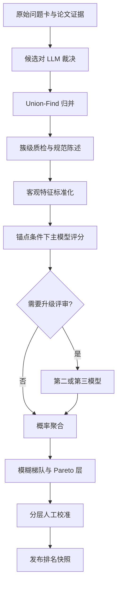

# 数学开放问题数据库：评分、统计、模糊排序与服务器管线标准化流程

> 版本：v1.0  
> 日期：2026-09-27  
> 适用工作区：`/home/user/Wholeworks/wanganan/math_openproblem/pilot/`  
> 当前规模：818 篇论文、7,471 张问题卡、2,305 个待裁决候选对，预计归并为约 6,000 个 canonical 问题  
> 工程目标：防熵增、可解释、可重放、可断点续跑、可审计

---

## 0. 一句话方案

系统不对约 6,000 个数学问题做全量两两比较，而是先将问题卡证据型归并为 canonical 条目，再为每个条目构造稳定的输入快照，使用多档锚点完成五档概率序数评分，最后由确定性代码根据档位概率、可信区间和不确定度生成模糊梯队。模型 API 只用于语义判断，归并建簇、指标标准化、概率聚合、排序、导出和审计全部由本地代码完成；第二、第三模型只处理高价值或高不确定条目，不对全库机械重复调用。

---

## 1. 最终要得到什么

系统的最终输出不是一个“数学问题总排行榜”，而是每个 canonical 问题的一组可解释属性：

| 属性 | 输出形式 | 用途 |
|---|---|---|
| 重要性 | `I1-I5` 概率分布、显示档位、期望档位 | 判断数学价值与领域影响 |
| 背景门槛 | `B1-B5` | 判断读懂和进入问题需要的知识 |
| 预测研究难度 | `R1-R5` | 判断达到前沿后仍需跨越的障碍 |
| 预测 AI 难度 | `A1-A5` 概率分布 | 判断当前 AI 是否有合理切入口 |
| 实测 AI 难度 | 标准化尝试结果、成功概率或 IRT 难度 | 衡量指定模型族的真实能力 |
| 人类难度 | 未来由平台行为和专家判断估计 | 与 AI 难度独立存储 |
| 数据可信度 | statement/status/canonical/evidence 四项质量 | 决定能否评分或是否需要复核 |

必须坚持以下原则：

1. 重要性和难度独立存储，禁止由其中一项推导另一项。
2. 背景深不等于 AI 难，陈述初等也不等于问题容易。
3. 被引量不是重要性的同义词，只是重要性判断中的一类证据。
4. 缺少证据的条目显示“未评级”，不能强行放进最低档。
5. 所有模型输出必须保留输入哈希、模型、提示词版本、日期和原始响应。
6. 发布层允许并列、边界档和不可比较，不制造伪精确名次。

---

## 2. 总体架构



核心复杂度：

- 模型评分：每个条目一次主评审，约为 `O(n)`。
- 代码排序：约为 `O(n log n)`。
- 两两比较：只用于数百个校准样本，不作为生产主线。
- 不建立约 `6000 × 5999 / 2` 的全量比较矩阵。

---

## 3. 服务器目录标准

现有工作区继续固定为：

```text
/home/user/Wholeworks/wanganan/math_openproblem/pilot/
```

建议最终整理为：

```text
pilot/
├── db.sqlite3
├── .env
├── README.md
├── pyproject.toml
├── config/
│   ├── pipeline.yaml
│   ├── providers.yaml
│   └── thresholds.yaml
├── prompts/
│   ├── canon_judge_v1.md
│   ├── statement_builder_v1.md
│   ├── scoring_v1.md
│   └── attempt_verifier_v1.md
├── pipeline/
│   ├── preflight.py
│   ├── canon_judge.py
│   ├── build_canonical.py
│   ├── validate_clusters.py
│   ├── build_features.py
│   ├── build_anchors.py
│   ├── enqueue_jobs.py
│   ├── api_worker.py
│   ├── aggregate_scores.py
│   ├── build_ranking.py
│   ├── validate_run.py
│   ├── export_snapshot.py
│   └── status.py
├── sql/
│   ├── migrations/
│   ├── views/
│   └── checks/
├── data/
│   ├── pending_pairs.jsonl
│   ├── anchor_bank.jsonl
│   └── snapshots/
├── runs/
│   └── <run_id>/
│       ├── manifest.json
│       ├── input_snapshot.jsonl
│       ├── raw_responses.jsonl
│       ├── failed_jobs.jsonl
│       ├── metrics.json
│       └── report.md
├── logs/
├── exports/
├── backups/
└── tests/
```

约束：

- 所有中间脚本只能放在 `pilot/` 下，不散落到 `/tmp` 或他人目录。
- `.env` 权限保持 `600`，日志和导出中不得写入 API key。
- 每个生产批次必须有唯一 `run_id`，例如：

```text
score-20260927T040000Z-imp-v1
```

- `runs/<run_id>/manifest.json` 是该批次的唯一说明书。

---

## 4. 哪些步骤调用 API，哪些步骤绝不调用 API

| 阶段 | 是否调用 API | 调用对象 | 何时允许调用 |
|---|---:|---|---|
| 数据库备份、完整性检查 | 否 | 本地 SQLite | 随时 |
| 生成候选归并对 | 否 | embedding＋规则 | 当前已冻结，不重算 |
| 候选对 same/distinct 裁决 | 是 | 主 LLM，失败时备用模型 | 脚本修复、dry-run 和备份完成后 |
| Union-Find 建簇 | 否 | 本地代码 | 所有候选对进入终态后 |
| 簇级矛盾检测 | 否 | 本地代码 | 建簇后立即运行 |
| 规范陈述生成 | 条件调用 | 强 LLM | 仅多卡簇或代表卡质量不足时 |
| statement 蕴含核验 | 条件调用 | 独立 LLM | 规范陈述由模型生成时 |
| 引用与 vitality 标准化 | 否 | SQL＋Python | canonical 和 MSC 冻结后 |
| 锚点检索 | 否 | embedding＋规则 | 每次生成评分输入包时 |
| 主评分 | 是 | 强 LLM | 先跑 300 条 pilot，通过门槛后全量 |
| Jev 评分 | 条件调用 | Jev | 首版只做 shadow judge，不进入最终分数 |
| 第二评审 | 条件调用 | 第二模型 | 由不确定度、高档位或随机抽检触发 |
| 第三评审 | 条件调用 | 第三模型 | 仅处理重大模型分歧 |
| 概率聚合 | 否 | 本地代码 | 所需评审全部终态后 |
| 模糊排序 | 否 | 本地代码 | 聚合完成后 |
| 人工校准 | 否 | 人工界面/CSV | pilot 后与发布前 |
| AI 真尝试求解 | 是，且高成本 | 研究模型＋工具 | 只对筛出的高价值候选后置运行 |
| 导出与报告 | 否 | SQL＋Python | 每个阶段结束时 |

最重要的运行纪律是：**不要让一个脚本在输入尚未冻结时自动调用模型。** 所有 API 作业必须先写入队列表，检查数量和预算，再由 worker 消费。

---

## 5. 全流程阶段门禁

## M0：启动前检查与冻结

### 要做什么

1. 进入唯一工作目录。
2. 检查 Git 状态，记录当前 commit。
3. 检查 `.env` 存在且权限为 `600`。
4. 备份数据库。
5. 执行 SQLite 完整性检查。
6. 计算 `pending_pairs.jsonl` 的 SHA-256，写进 run manifest。
7. 确认没有旧 worker 正在写相同表。

### 当前可直接使用的命令

```bash
ssh -o BatchMode=yes node01
cd /home/user/Wholeworks/wanganan/math_openproblem/pilot/

git status --short
git rev-parse HEAD
stat -c '%a %n' .env

mkdir -p backups logs runs exports

run_stamp="$(date -u +%Y%m%dT%H%M%SZ)"
sqlite3 db.sqlite3 ".backup 'backups/db_pre_${run_stamp}.sqlite3'"
sqlite3 db.sqlite3 "PRAGMA integrity_check;"
sha256sum pending_pairs.jsonl
```

### 放行条件

- `integrity_check = ok`。
- `.env` 权限为 `600`。
- 数据库备份存在且大小合理。
- `pending_pairs.jsonl` 哈希已记录。
- 当前 Git commit 已记录。

### 是否调用 API

否。

---

## M1：修复并验证 canonical pair 裁决器

### 已知必须修复的问题

1. worker 中读取 `texts` 的 `con.execute` 必须进入 `con_lock`。
2. JSON 解析失败不能静默写成 `unsure`。
3. 首次解析失败后只自动重试一次。
4. 第二次仍失败写成 `parse_fail`。
5. `parse_fail` 与 `unsure` 必须是不同终态。
6. 每批输入保存 `input_hash`，避免重复计费。

### 测试顺序

```bash
# 只做静态检查和单元测试，不调用 API
python3 -m compileall pipeline canon_judge.py
python3 -m pytest -q

# dry-run：构造 payload、验证 SQL、验证输出路径，不发请求
python3 canon_judge.py --dry-run --limit-pairs 16

# 小流量真实测试：只调用 2 批 API
python3 canon_judge.py --limit-pairs 16 --workers 1
```

如果现有脚本尚不支持这些参数，应先由 Codex 补齐，不能直接拿全量任务测试。

### 小流量测试放行条件

- 16 对全部进入 `same/distinct/unsure/parse_fail` 之一。
- 没有 `sqlite3.InterfaceError`。
- 无重复 `input_hash` 调用。
- 原始响应能够回放解析。
- 日志不含 key。

### 是否调用 API

- 静态检查和 dry-run：否。
- `--limit-pairs 16`：是，约 2 批。

---

## M2：清除已知脏裁决并全量运行 2,305 对

### 操作原则

现有 112 条可疑结果必须作废后重跑。删除前先备份数据库，并输出删除前计数。生产环境中禁止无记录地执行 DELETE。

```sql
SELECT verdict, COUNT(*)
FROM canon_verdicts
GROUP BY verdict;

-- 确认备份完成后再执行
DELETE FROM canon_verdicts;
```

### 启动方式

```bash
run_id="canon-$(date -u +%Y%m%dT%H%M%SZ)-v1"
mkdir -p "runs/${run_id}" logs

nohup python3 canon_judge.py \
  --run-id "${run_id}" \
  --input pending_pairs.jsonl \
  --batch-size 8 \
  --workers 4 \
  >> "logs/${run_id}.log" 2>&1 &

echo $! > "runs/${run_id}/worker.pid"
```

如果当前脚本还没有 `--run-id`、`--input`、`--batch-size` 等参数，应先改造脚本。不要为了照抄命令而虚构已有能力。

### API 调用策略

主链：

```text
GLM_CODING_TEAM2_KEY
  → GLM_CODING_TEAM_KEY
  → GLM_CODING_LITE_KEY
  → BAILIAN_TOKENPLAN_KEY
  → SILICONFLOW_KEY
```

GLM 只能使用：

```text
https://open.bigmodel.cn/api/coding/paas/v4
```

禁止误用按量余额端点：

```text
https://open.bigmodel.cn/api/paas/v4
```

### 错误处理

| 错误 | 动作 |
|---|---|
| 429 且包含 `1310` / “使用上限” | 标记当前 provider 暂停，切换下一个 provider |
| 普通 429 | 按 `Retry-After` 或指数退避重试 |
| 500/502/503/529 | 指数退避，最多 3 次 |
| 401/403 | 立即停止该 provider，不循环重试，检查凭据或权限 |
| 400/422 | 视为 payload/schema 问题，停止批次并修代码，不切模型掩盖错误 |
| JSON 解析失败 | 原模型重试一次，仍失败写 `parse_fail` |
| SQLite 写入错误 | 停止 worker，禁止继续请求产生无法落库的付费响应 |

### 监控命令

```bash
tail -f "logs/${run_id}.log"

sqlite3 db.sqlite3 "
SELECT verdict, COUNT(*)
FROM canon_verdicts
GROUP BY verdict
ORDER BY verdict;"
```

### 完成条件

```text
same + distinct + unsure + parse_fail = 2305
```

且：

- `parse_fail` 已单独统计。
- 没有未结束的 `running` 作业。
- `PRAGMA integrity_check = ok`。
- 原始 JSONL 导出完成。

### 是否调用 API

是。预计约 289 个批次调用，允许断点续跑。

---

## M3：Union-Find 建簇与 canonical 生成

### 要做什么

1. 只读取 `verdict='same'` 的边。
2. `distinct/unsure/parse_fail` 不合并。
3. 使用 union-find 生成连通分量。
4. 生成 `canonical_problem`。
5. 回填 `problems.canonical_uid`。
6. 导出大簇和矛盾簇复核清单。

### UID 规则

```text
op-2026-NNNNNN
```

UID 一旦发布不可因重新排序而改变。若后续拆簇，应新建 UID，并使用关系表记录 `split_from`。

### 特别风险：传递闭包误并

若：

```text
A same B
B same C
A distinct C
```

则不能让 union-find 无条件合并。必须在建簇前检测这种矛盾三元组，进入人工或强模型复核队列。

### 建议目标命令

```bash
python3 -m pipeline.build_canonical \
  --db db.sqlite3 \
  --run-id "${run_id}" \
  --only-verdict same

python3 -m pipeline.validate_clusters \
  --db db.sqlite3 \
  --export "runs/${run_id}/cluster_audit.json"
```

### 必须统计的指标

| 指标 | 含义 |
|---|---|
| `n_canonical` | canonical 总数 |
| `cluster_size_p50/p90/p99` | 簇大小分布 |
| `singleton_rate` | 单卡条目比例 |
| `multi_paper_rate` | 跨论文条目比例 |
| `cluster_embedding_diameter` | 簇内最大或 P95 语义距离 |
| `contradiction_triples` | 矛盾闭包数量 |
| `large_cluster_count` | 卡数 ≥10 的簇数 |
| `sampled_merge_precision` | 分层抽检中正确合并比例 |
| `sampled_split_recall` | 未合并高相似样本中的漏并比例 |

### 放行条件

- 不存在未解决的矛盾三元组。
- 所有原始问题卡恰好映射到一个 canonical。
- 大簇清单已导出。
- 抽样合并精度达到项目预设门槛。

### 是否调用 API

否。全部由本地代码和 SQL 完成。

---

## M4：规范陈述与状态质量门禁

### 代表卡选择

不能只取“最长 self-contained 卡”。建议顺序：

1. `open_at_paper_time` 明确。
2. 数学条件完整。
3. source quote 可定位。
4. statement 信息密度高而非单纯文本长。
5. 能覆盖簇内共同主张。

### 何时调用 API

以下情况调用强 LLM 构造 `statement_en`：

- canonical 含多张卡，需要融合共同陈述。
- 最佳代表卡不完整。
- 存在多个别名或表述体系。
- 需要把上下文依赖改写成独立陈述。

以下情况不调用 API：

- 单卡条目且陈述已经 self-contained。
- 只需复制原始完整陈述并做确定性清洗。

### API 任务

```text
task_type = statement_build
输入 = 候选证据卡 + 原文位置 + 共同条件
输出 = statement_en + source_ids + omitted_details + confidence
```

模型生成后，再由独立验证任务检查：

```text
task_type = statement_verify
问题 1：新陈述是否比证据更强？
问题 2：是否丢失必要条件？
问题 3：是否把研究方向误写成严格命题？
```

### 门禁字段

```text
statement_quality         0..1
status_confidence         0..1
canonical_confidence      0..1
evidence_completeness     0..1
review_state              draft|verified|blocked
```

若任一关键质量低于门槛，条目进入 `ungraded`，不进入 I1-I5。

---

## M5：客观指标快照与标准化

### 原始指标

- `n_total_citations`
- `n_recent_citations`
- `vitality`
- `n_supporting_cards`
- `n_distinct_papers`
- `age_years`
- `in_alias_hotlist`
- `msc_primary/secondary`

### 标准化

对计数型指标先做：

```math
x_{log} = \log(1+x)
```

再按：

```text
MSC 大类 × 发表时间窗
```

计算分位数：

```math
x' = \operatorname{Percentile}(x_{log}\mid MSC,\ year\_bucket)
```

时间窗首版可使用：

```text
2000-2004
2005-2009
2010-2014
2015-2019
2020-2025
```

若某组样本太少，则依次退化到：

```text
MSC 大类 → 全局分位数
```

原始值与标准化值必须同时保存。

### 重要原则

- `age_years` 只用于归一化和偏差审计，不直接加减分。
- `in_alias_hotlist` 与跨论文数可能重复，不应机械重复加权。
- 第一版不手工拼一个神秘“客观总分”。
- 客观信号作为 evidence profile 输入评审器，同时独立展示。
- 有人工校准集后，再用序数逻辑回归学习权重。

### 是否调用 API

否。

---

## M6：建立锚点库

### 为什么现有 top 10 不够

只有 Riemann hypothesis、Hodge、Kakeya 等顶层锚点，只定义了 I5 的天花板，没有定义 I1-I4 的边界。模型仍会在中低档漂移。

### 首版建议

- 总量 60-100 个。
- 每档至少 8-12 个。
- 覆盖主要 MSC 大类。
- 包含顶层公认问题、中档实质研究问题、局部技术问题和抽取噪声。
- 每个锚点至少保存：

```text
anchor_id
canonical_uid
dimension
gold_tier
msc_group
rationale
evidence_ids
reviewers
rubric_version
valid_from / valid_to
```

### 锚点如何进入评分输入

对每个待评分条目，本地检索：

- 同领域同档附近 3-5 个。
- 相邻档 2-3 个。
- 跨领域全局锚点 1-2 个。

锚点选择由 embedding 和规则完成，不调用 API。必须保存 `anchor_ids`，确保输入可重放。

### 是否调用 API

- 构造锚点候选：否。
- 锚点最终定档：建议人工；必要时可让强模型给意见，但不能自动成为 gold。

---

## M7：300 条 pilot 评分

不要直接对约 6,000 条全量评分。先构造 300 条分层 pilot：

- 覆盖主要 MSC 大类。
- 覆盖不同年代。
- 覆盖单卡、多卡、跨论文簇。
- 覆盖不同引用分位数。
- 覆盖 statement_quality 边界。
- 覆盖预估 I1-I5 与 A1-A5。

### 推荐的一次主评分 API 输出

为节约调用，可在一次请求中返回相互独立的多个 section，但提示词必须禁止维度互推：

```json
{
  "canonical_uid": "op-2026-000123",
  "importance": {
    "tier_probabilities": [0.02, 0.08, 0.42, 0.40, 0.08],
    "criterion_levels": {
      "centrality": 3,
      "downstream_impact": 4,
      "method_value": 3,
      "sustained_attention": 2
    },
    "rationale": "...",
    "evidence_ids": ["..."]
  },
  "background_depth": {
    "tier_probabilities": [0.00, 0.05, 0.25, 0.55, 0.15]
  },
  "research_depth_pred": {
    "tier_probabilities": [0.01, 0.04, 0.20, 0.50, 0.25]
  },
  "ai_difficulty_pred": {
    "tier_probabilities": [0.05, 0.20, 0.45, 0.25, 0.05],
    "features": {
      "verifiability": 4,
      "decomposability": 3,
      "finite_experimentation": 2,
      "formalization_readiness": 2,
      "novel_method_dependence": 4,
      "feedback_density": 3
    }
  },
  "abstain_reason": null
}
```

### 为什么保存完整概率

不能只保存：

```json
{"tier": 4, "confidence": "high"}
```

必须保存五档概率，才能：

- 识别 I3↔I4 边界。
- 计算熵和置信区间。
- 聚合多个模型。
- 后续做概率校准。
- 形成模糊并列块。

### pilot API 调用量

如果一个条目一次请求返回全部预测维度：

```text
主评分约 300 次
第二评审约 75 次（假设 25% 升级）
第三评审约 15 次（假设 5% 重大分歧）
Jev shadow 可只抽 100-150 条
```

### pilot 放行门槛

| 指标 | 建议起始门槛 |
|---|---:|
| 锚点相邻一档内准确率 | ≥90% |
| 人工 weighted kappa | ≥0.65 |
| 档位边界比较一致率 | ≥80% |
| Top-K 专家认可率 | ≥80% |
| ECE | ≤0.10 |
| 重跑档位保持率 | ≥90% |
| parse_fail | <0.5% |
| provenance 完整率 | 100% |

这些门槛是 pilot 工程目标，不是普遍定理；应报告置信区间。

### 是否调用 API

是，但仅 pilot 样本。

---

## M8：全量主评分

只有 M7 验收通过后，才允许生成全量评分作业。

### 作业生成

```bash
score_run="score-$(date -u +%Y%m%dT%H%M%SZ)-v1"

python3 -m pipeline.enqueue_jobs \
  --db db.sqlite3 \
  --run-id "${score_run}" \
  --task-type score_primary \
  --scope eligible_canonical \
  --dry-run
```

先查看：

- 将生成多少任务。
- 预计输入 token。
- 哪些条目因门禁被排除。
- 所需 provider 预算。

确认后再去掉 `--dry-run`：

```bash
python3 -m pipeline.enqueue_jobs \
  --db db.sqlite3 \
  --run-id "${score_run}" \
  --task-type score_primary \
  --scope eligible_canonical
```

### 启动 worker

```bash
nohup python3 -m pipeline.api_worker \
  --db db.sqlite3 \
  --run-id "${score_run}" \
  --task-type score_primary \
  --workers 4 \
  >> "logs/${score_run}.log" 2>&1 &

echo $! > "runs/${score_run}/worker.pid"
```

### 自动升级条件

主评分成功后，本地代码计算：

```text
top_probability
margin
normalized_entropy
predicted_tier
statement_quality
```

满足任一条件就写入 `score_secondary` 队列：

```text
top_probability < 0.60
margin < 0.20
normalized_entropy > 0.65
importance top tier ∈ {I4, I5}
statement/status 接近质量门槛
属于 10% 分层随机审计样本
```

第二评审后，满足任一条件写入 `score_tertiary`：

```text
两模型 expected_tier 差 > 1
I5 或首页候选存在显著分歧
两个模型给出的最高档不相邻
```

### 调用量估计

若 6,000 条都合格：

```text
主评分约 6,000 次
二审约 1,500 次（25%）
三审约 300 次（5%）
总计约 7,800 次
```

这比两个维度分别做三模型全量约 36,000 次显著更低。实际调用量必须由 dry-run 预算报告确定。

---

## 6. API 作业队列设计

禁止 worker 直接遍历 canonical 表并看到一条就请求一条。必须先写入持久化作业队列。

### 推荐表结构

```sql
CREATE TABLE api_job (
    id INTEGER PRIMARY KEY,
    run_id TEXT NOT NULL,
    task_type TEXT NOT NULL,
    canonical_uid TEXT,
    input_hash TEXT NOT NULL,
    prompt_version TEXT NOT NULL,
    provider TEXT,
    model TEXT,
    status TEXT NOT NULL CHECK (
        status IN ('pending','leased','succeeded','retry','failed','blocked')
    ),
    priority INTEGER NOT NULL DEFAULT 0,
    attempt_count INTEGER NOT NULL DEFAULT 0,
    max_attempts INTEGER NOT NULL DEFAULT 3,
    lease_owner TEXT,
    lease_expires_at TEXT,
    next_retry_at TEXT,
    error_code TEXT,
    error_message TEXT,
    created_at TEXT NOT NULL,
    updated_at TEXT NOT NULL,
    UNIQUE(task_type, input_hash, model)
);

CREATE INDEX idx_api_job_pick
ON api_job(run_id, task_type, status, priority DESC, id);
```

结果与作业分开：

```sql
CREATE TABLE model_judgment (
    id INTEGER PRIMARY KEY,
    api_job_id INTEGER NOT NULL UNIQUE,
    run_id TEXT NOT NULL,
    canonical_uid TEXT NOT NULL,
    judge_id TEXT NOT NULL,
    dimension TEXT NOT NULL,
    probabilities_json TEXT NOT NULL,
    expected_tier REAL NOT NULL,
    rationale TEXT,
    evidence_ids_json TEXT,
    raw_response_json TEXT NOT NULL,
    input_tokens INTEGER,
    output_tokens INTEGER,
    latency_ms INTEGER,
    cost_usd REAL,
    created_at TEXT NOT NULL,
    FOREIGN KEY(api_job_id) REFERENCES api_job(id)
);
```

### worker 生命周期

1. 用事务领取一个 `pending/retry` 作业。
2. 写入 `lease_owner` 和过期时间。
3. 读取已冻结的 `scoring_input_snapshot`。
4. 校验 input hash。
5. 根据 provider 状态选择 API。
6. 发出请求。
7. 验证 HTTP 状态和 JSON schema。
8. 解析失败时原请求重试一次。
9. 成功则在一个事务中写 `model_judgment` 并把作业改为 `succeeded`。
10. 失败则根据错误类型写 `retry/failed/blocked`。
11. 定期回收 lease 已过期的僵尸作业。

### 幂等性

`input_hash` 至少包括：

```text
canonical_uid
statement_hash
status_snapshot_hash
objective_feature_snapshot_hash
anchor_ids
rubric_version
prompt_version
model_version
task_type
```

同一 `task_type + input_hash + model` 不允许重复调用。

---

## 7. Provider 与重试策略

### 配置原则

`.env` 只存密钥；provider 顺序、端点和限额写在 `config/providers.yaml`。

示例：

```yaml
providers:
  glm_team2:
    api_key_env: GLM_CODING_TEAM2_KEY
    base_url: https://open.bigmodel.cn/api/coding/paas/v4
    enabled: true
    daily_call_budget: 3000

  glm_team:
    api_key_env: GLM_CODING_TEAM_KEY
    base_url: https://open.bigmodel.cn/api/coding/paas/v4
    enabled: true

  glm_lite:
    api_key_env: GLM_CODING_LITE_KEY
    base_url: https://open.bigmodel.cn/api/coding/paas/v4
    enabled: true

  bailian:
    api_key_env: BAILIAN_TOKENPLAN_KEY
    enabled: true

  siliconflow:
    api_key_env: SILICONFLOW_KEY
    enabled: true
```

不要把 key、完整 Authorization header 或原始凭据写进 YAML、日志和 Git。

### 指数退避建议

```text
第 1 次：5 秒
第 2 次：20 秒
第 3 次：60 秒
加入 0-20% 随机抖动
```

不得长时间阻塞线程睡眠。作业应写 `next_retry_at`，worker 去处理其他任务。

### Provider 熔断

以下情况临时熔断 provider：

- 连续 5 次 5xx/529。
- 一分钟内 429 比例超过阈值。
- 额度墙 `1310`。
- 认证失败。

熔断状态保存在数据库或 run state，不只放内存，否则重启会忘记。

---

## 8. 评分聚合

设第 `m` 个模型输出五档概率：

```math
p^{(m)}=(p^{(m)}_1,\ldots,p^{(m)}_5)
```

没有人工校准集时使用等权线性意见池：

```math
\bar p_k = \sum_m w_m p^{(m)}_k,
\qquad \sum_m w_m=1
```

有校准集后，可根据保留集 log loss 学习模型权重，但应设置权重上下限。

计算：

```math
\mu=\sum_{k=1}^{5}k\bar p_k
```

```math
\sigma^2=\sum_{k=1}^{5}(k-\mu)^2\bar p_k
```

```math
H=-\frac{\sum_k \bar p_k\log \bar p_k}{\log 5}
```

保存：

```text
expected_tier = μ
tier_variance = σ²
entropy = H
margin = 最大概率 - 第二大概率
model_spread = 各模型 expected_tier 的离散程度
p_high = P(I≥4)
tier_interval_80 = 10%-90% 离散分位档
```

### 初始置信状态

| 状态 | 建议初始规则 | 前端显示 |
|---|---|---|
| `confident` | max p≥0.60、margin≥0.20、H≤0.65、spread≤0.75 | 单档，如 I4 |
| `boundary` | 前两档相邻且概率和≥0.75，但 margin<0.20 | I3↔I4 |
| `disputed` | 模型差>1 档，或最高两档不相邻 | 进入复核，不给精确名次 |
| `ungraded` | 输入质量不足或调用失败 | 未评级 |

这些阈值必须通过 pilot 调整。

### 是否调用 API

否。聚合必须是确定性纯函数。

---

## 9. 模糊排序算法

## 9.1 主排序

1. 按 `display_tier` 从高到低分层。
2. 同档内按 `expected_tier` 降序得到临时顺序。
3. 为每个条目计算 80% 档位区间 `[q0.10,q0.90]`。
4. 沿临时顺序扫描。
5. 相邻条目区间重叠，则放入同一 `fuzzy_block`。
6. 只有一个条目的下界高于另一个条目的上界时，才宣称稳定领先。
7. `ungraded` 和 `disputed` 不进入公开精确排序。

这一步只需排序数值，复杂度约 `O(n log n)`。

## 9.2 概率支配

如需判断问题 `i` 是否高于问题 `j`，可由分布直接计算：

```math
P(i>j)=\sum_a\sum_b \mathbf{1}[a>b]p_i(a)p_j(b)
```

仅当：

```text
P(i>j) ≥ 0.80
```

才建立稳定关系 `i ≻ j`。否则视为同一模糊区域或不可比较。

不需要计算全库所有题对，只检查排序后的相邻项或用户查询涉及的局部候选。

## 9.3 不同产品使用不同排序

| 场景 | 排序键 |
|---|---|
| 首页重要问题 | `P(I≥4)`＋稳定性门槛 |
| 人工复核队列 | 潜在高重要性 × entropy × 数据质量 |
| 数学问题抽卡 | 重要性与 AI 可进入性的 Pareto 层 |
| 冷门探索 | 高重要概率＋领域曝光约束＋适度不确定性奖励 |

不要把所有场景压成一个永久综合分。

### 数学研究 Agent 的首选条件

优先选择：

```text
高重要性
当前仍开放
陈述与状态可信
AI 难度不太高
有可验证反馈
能分解为局部任务
```

推荐视图应首先返回二维坐标和 Pareto layer，再提供一个内部检索排序键。

---

## 10. 少量人工比较如何布置

两两比较不是生产评分前置依赖，只是校准工具。

| 样本 | 建议数量 | 目的 |
|---|---:|---|
| 同档近邻 | 每档 20-30 对 | 检查系统是否制造虚假精确差异 |
| 四个档位边界 | 每边界 30-40 对 | 检查 I1/2、I2/3、I3/4、I4/5 |
| 跨领域对照 | 50-80 对 | 检查领域偏置 |
| Top-K 审计 | 50 个条目或 30-50 对 | 保证首页候选质量 |
| 随机保留集 | 100-150 条 | 估计总体误差 |

人工资源有限时，首版可做：

```text
150 个分层条目绝对分档
120 个边界比较
20% 样本双人复核
```

随机 50 对且只统计“同梯队一致率”不足以验证顶部精度、领域偏差和概率校准。

---

## 11. AI 实测难度管线

AI 实测难度必须后置，只对高重要性且可能适合 AI 的问题运行。

### 结果等级

| 等级 | 定义 |
|---:|---|
| 0 | 无有效进展：复述、明显错误、不可核查猜测 |
| 1 | 可用探索：正确小例子、文献化归、失败路线诊断 |
| 2 | 局部进展：新特殊情形、改进界、可验证计算证据或有效引理 |
| 3 | 主要突破：解决核心障碍但仍有明确缺口 |
| 4 | 完整候选解：完整证明或反例，并通过独立严格核验 |

### 标准化协议

- 固定模型版本。
- 固定 token、时间、工具与检索预算。
- 每题使用多个独立轨迹。
- 解题模型不得给自己判成功。
- 保存完整日志哈希和验证报告。
- 实测难度绑定模型版本和日期，不写成问题永久属性。

### IRT 建模

把模型看作答题者、问题看作试题：

```math
P(success\mid m,i)=\operatorname{sigmoid}(ability_m-difficulty_i)
```

若使用 0-4 的进展等级，可以采用 graded-response IRT。样本少时使用 Beta-Binomial 区间，不能把 `1/1` 成功解释为 100% 可解。

---

## 12. 监控面板和状态命令

建议提供统一入口：

```bash
python3 -m pipeline.status --db db.sqlite3 --run-id "${score_run}"
```

至少输出：

```text
总作业数
pending / leased / succeeded / retry / failed / blocked
各 provider 调用数与错误率
累计 token / 成本
p50 / p95 latency
预计剩余时间
parse_fail 数量
最近一次成功时间
僵尸 lease 数量
```

常用 SQL：

```sql
SELECT status, COUNT(*)
FROM api_job
WHERE run_id = :run_id
GROUP BY status;

SELECT provider, error_code, COUNT(*)
FROM api_job
WHERE run_id = :run_id AND status IN ('retry','failed','blocked')
GROUP BY provider, error_code;

SELECT dimension,
       AVG(expected_tier),
       AVG(entropy),
       COUNT(*)
FROM score_aggregate
WHERE run_id = :run_id
GROUP BY dimension;
```

---

## 13. 暂停、停机与恢复

## 13.1 正常暂停

优先使用软停止文件或 SIGTERM，让 worker 完成当前请求后退出：

```bash
touch "runs/${score_run}/STOP_REQUESTED"
```

worker 每领取新任务前检查该文件。

如果尚未实现软停止：

```bash
kill -TERM "$(cat runs/${score_run}/worker.pid)"
```

不要直接 `kill -9`，除非进程完全失控。

## 13.2 停机后检查

```bash
sqlite3 db.sqlite3 "PRAGMA wal_checkpoint(FULL);"
sqlite3 db.sqlite3 "PRAGMA integrity_check;"

stop_stamp="$(date -u +%Y%m%dT%H%M%SZ)"
sqlite3 db.sqlite3 ".backup 'backups/db_stop_${stop_stamp}.sqlite3'"
```

记录：

- 为什么停机。
- 最后成功 job id。
- 各状态数量。
- provider 状态。
- Git commit。

## 13.3 恢复

恢复前：

1. 检查数据库完整性。
2. 回收过期 lease。
3. 不重置 succeeded。
4. 只把符合条件的 stale `leased` 改回 `pending`。
5. 重新启动相同 `run_id` 的 worker。

```bash
python3 -m pipeline.api_worker \
  --db db.sqlite3 \
  --run-id "${score_run}" \
  --resume \
  --workers 4
```

---

## 14. 每个阶段结束时的固定收尾

每完成一个阶段，统一执行：

1. 数据库 `integrity_check`。
2. 输出阶段指标 JSON。
3. 导出新增表的 JSONL 快照。
4. 写 run report。
5. 记录 Git commit。
6. 做数据库备份。
7. 只有验收通过才进入下一阶段。

建议命令：

```bash
python3 -m pipeline.validate_run \
  --db db.sqlite3 \
  --run-id "${run_id}" \
  --write-report "runs/${run_id}/report.md"

python3 -m pipeline.export_snapshot \
  --db db.sqlite3 \
  --run-id "${run_id}" \
  --output "exports/${run_id}"

sqlite3 db.sqlite3 "PRAGMA integrity_check;"
git add pipeline config prompts sql tests
git commit -m "pipeline: complete ${run_id}"
```

数据库和包含模型原始输出的大文件是否进入 Git，应根据仓库策略决定；至少 manifest、schema、prompt、代码和指标报告必须进入版本控制。

---

## 15. 首次上线后的周期任务

完整 canonical 与评分管线不是每天全量重跑。上线后采用增量更新。

| 周期 | 任务 | 是否调用 API |
|---|---|---:|
| 每日 | 检查失败作业、状态事件增量、日志健康 | 条件调用 |
| 每周 | 新增论文/问题卡归并、低置信复核 | 条件调用 |
| 每月 | 更新 citations、recent citations、vitality 分位数 | 通常否 |
| 每月或版本变更 | 锚点漂移测试、模型 repeat stability | 是，小样本 |
| 每季度 | 人工校准集扩充、阈值重估、字段偏差审计 | 少量调用 |
| 模型版本变化 | 新旧模型在固定 gold set 上 A/B，不立即全量替换 | 是，小样本 |

### 自动重评分触发条件

只有以下变化才为条目生成新的评分任务：

- `statement_hash` 改变。
- `current_status` 或状态证据发生实质变化。
- objective feature snapshot 跨越重要分位区间。
- rubric/prompt/model version 改变。
- 锚点库版本改变。
- 条目原结果为 `disputed/ungraded`，且新增了证据。

其他条目继续复用已有结果。

---

## 16. 完整执行顺序清单

按以下顺序执行，禁止跳阶段：

```text
[M0] 启动前检查、备份、记录哈希
  ↓
[M1] 修 canon_judge.py，跑单元测试、dry-run、16 对真实测试
  ↓
[M2] 清除 112 条脏裁决，全量裁决 2,305 对
  ↓
[M3] Union-Find 建簇，检查矛盾闭包、大簇和簇直径
  ↓
[M4] 生成并核验规范陈述，建立质量门禁
  ↓
[M5] 计算客观特征快照和 MSC×年代分位数
  ↓
[M6] 建立 60-100 个多档、多领域锚点
  ↓
[M7] 300 条 pilot 主评分、升级评审、Jev shadow 测试
  ↓
[M7-gate] 人工校准和验收；不通过则修 rubric/输入/阈值
  ↓
[M8] 全量主评分
  ↓
[M9] 根据熵、margin、高档位与抽检规则自动生成二审/三审
  ↓
[M10] 确定性概率聚合
  ↓
[M11] 生成模糊梯队、并列块和 Pareto 层
  ↓
[M12] Top-K 人工审计与最终发布快照
  ↓
[M13] 只对高价值候选运行 AI 真尝试求解
```

---

## 17. 给服务器 Codex 的实施边界

当把这份流程交给服务器 Coding Agent 时，应明确：

1. 第一轮只实现/修复代码和 dry-run，不自动发全量 API 请求。
2. 每次真实批量调用前先输出任务数、预计 token、预计费用和 provider 顺序。
3. pilot 未通过门槛时，禁止全量评分。
4. 任何 DELETE、迁移或表重建前必须先备份并输出影响行数。
5. 不触碰 `/home/user/Wholeworks/` 下其他人的目录。
6. 不修改被冻结的 `pending_pairs.jsonl`。
7. 不把解析失败伪装成 `unsure`。
8. 不把模型自评当作 AI 求解成功。
9. 不覆盖历史 run，不静默改分。
10. 每完成一步，用中文报告“做了什么、数字结果、问题、下一步”。

---

## 18. 最终验收清单

### 数据库

- [ ] `PRAGMA integrity_check = ok`
- [ ] 所有 problem 恰好映射到一个 canonical
- [ ] 无未处理矛盾三元组
- [ ] statement/status/feature 快照有 hash
- [ ] 所有生产评分有 provenance

### API 作业

- [ ] 无永久 `leased` 作业
- [ ] `parse_fail` 单独统计
- [ ] 401/403 不被无限重试
- [ ] 额度墙能熔断并切 provider
- [ ] 同一 input hash 不重复计费

### 评分

- [ ] 保存完整五档概率
- [ ] 重要性与难度分列
- [ ] 背景门槛不冒充 AI 难度
- [ ] 边界档与未评级可表达
- [ ] pilot 达到门槛后才全量运行

### 排序

- [ ] 不做全量两两比较
- [ ] 模糊并列块可重放
- [ ] Top-K 通过人工审计
- [ ] 推荐页优先展示二维坐标/Pareto 层
- [ ] 每次发布生成不可变 ranking snapshot

---

## 19. 参考方法

1. Bradley, R. A.; Terry, M. E. (1952). *Rank Analysis of Incomplete Block Designs: I. The Method of Paired Comparisons*. Biometrika 39(3/4):324-345.
2. McCullagh, P. (1980). *Regression Models for Ordinal Data*. JRSS-B 42(2):109-142.
3. Jamieson, K. G.; Nowak, R. D. (2011). *Active Ranking Using Pairwise Comparisons*. NeurIPS 24.
4. Guo, C.; Pleiss, G.; Sun, Y.; Weinberger, K. Q. (2017). *On Calibration of Modern Neural Networks*. ICML 2017.
5. TypeSafe AI Jev documentation: <https://docs.typesafe.ai/>

---

## 20. 最终决策摘要

| 决策项 | 采用方案 |
|---|---|
| 主排序范式 | 锚点条件下的概率序数分类 |
| 梯队 | I1-I5，有语义但不强制等容量 |
| 全量比较 | 不做 |
| 多模型调用 | 一审全量，二审按不确定性升级，三审只处理重大分歧 |
| 聚合 | 聚合完整概率，不取中位 tier |
| 客观指标 | 按 MSC×年代标准化，原始值与分位数并存 |
| 模糊排序 | display tier＋expected tier＋80% 区间＋fuzzy block |
| 人工数据 | 只做分层校准、档位边界和 Top-K 审计 |
| Jev | 首版 shadow judge，项目内达标后再承担低风险任务 |
| AI 难度 | 预测难度与实测难度分开 |
| 发布 | 不可变 ranking snapshot，可追踪到输入和模型运行 |

这套设计不需要推翻现有工程。最重要的升级是：在现有 canonical 管线上增加输入快照、API 作业队列、多档锚点、完整概率输出、质量门禁和模糊排序层。实际下一步仍然是修复 canonical 裁决器并跑完 2,305 对，而不是提前对 6,000 条问题全量评分。
